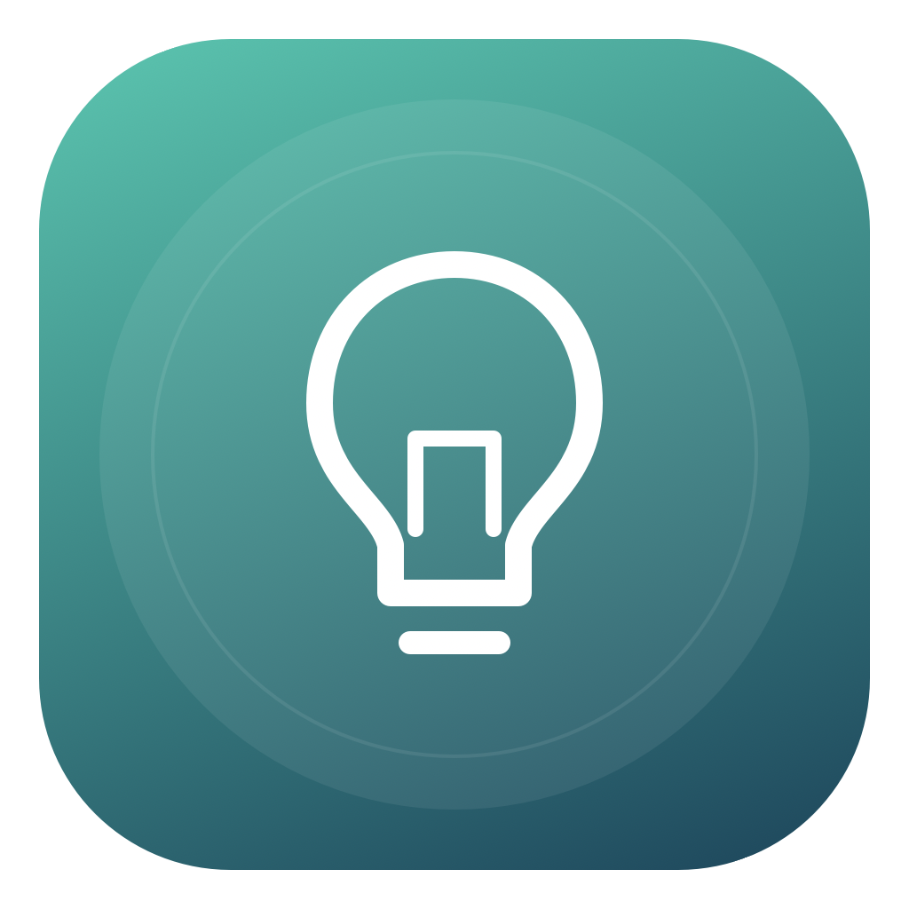
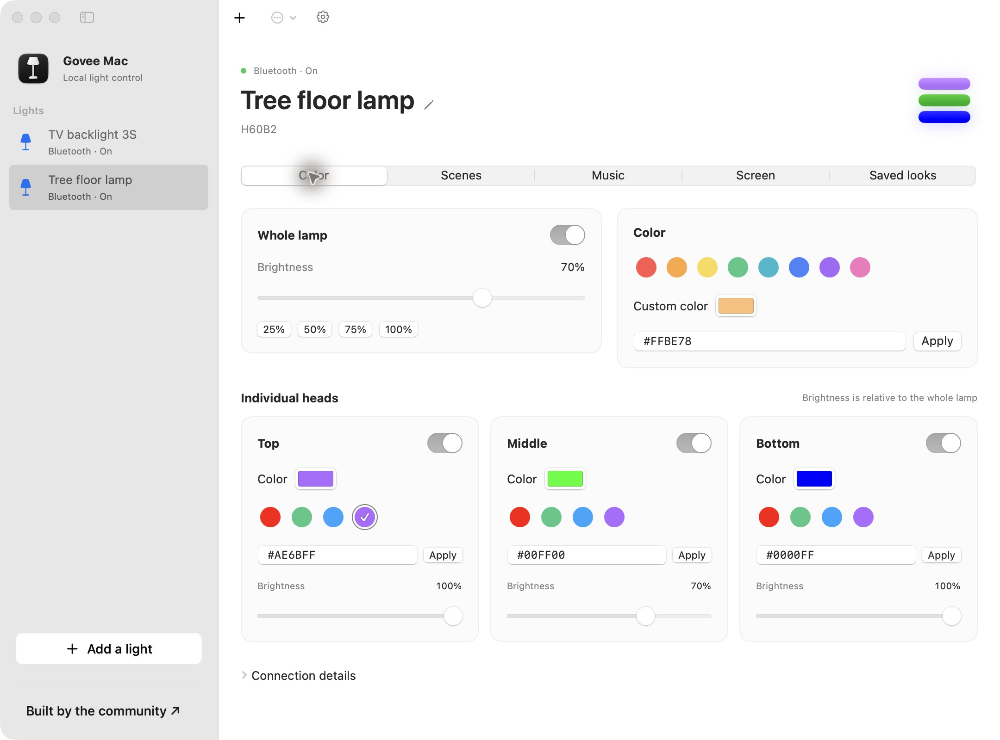
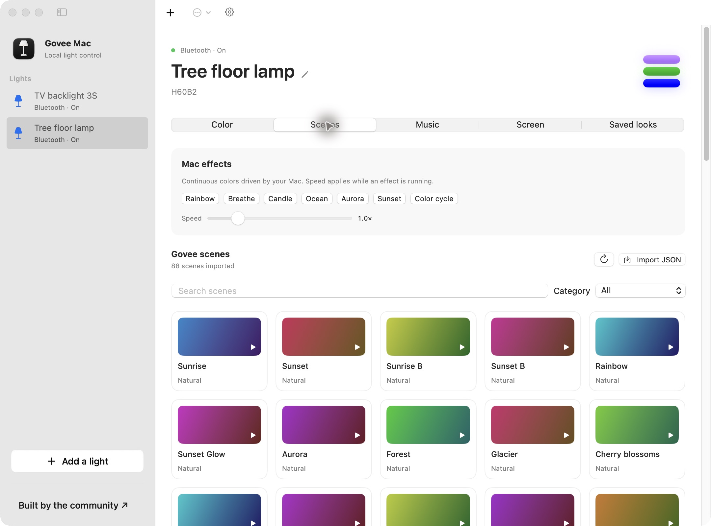

<p align="center">
  
</p>

<h1 align="center">Govee Mac</h1>
<p align="center"><strong>Your lights. Your Mac.</strong><br>Native, local control for Govee lights. Built by the community.</p>

<p align="center">
  <a href="LICENSE"></a>
  
  <a href="https://github.com/jasonkneen/ShadKit"></a>
</p>

Govee Mac is an independent, open-source macOS app for controlling compatible Govee lights over **Bluetooth LE** or **local Wi-Fi**. No Govee account, API key, subscription, or telemetry is required. Scene definitions are downloaded from Govee and cached; light control, screen analysis, and audio analysis run locally.

This is an early community release. Device support varies by model and firmware; please help us build the [compatibility list](docs/COMPATIBILITY.md).





## What you can do

- Discover LAN-enabled lights on your network or nearby compatible Bluetooth lights.
- Turn lights on or off, set brightness, and choose an RGB color.
- Control each H60B2 Tree lamp head separately, including color, brightness, and on/off.
- Adjust white temperature over LAN on models that support it.
- Run native Govee scenes, including all 88 scenes in the H60B2 Tree lamp library.
- Search scene categories, cache them offline, and import scene-library JSON.
- Run animated Mac effects with adjustable speed.
- Sync lights to system audio or microphone input, with adjustable sensitivity.
- Match a display’s colors using whole-screen or per-head regions.
- Control lights, heads, scenes, and sync from the bundled JSON CLI for agents and scripts.
- Apply six built-in looks, or save your own color, brightness, temperature, and mixed-head presets.
- Rename lights, mark favorites, and control them from the macOS menu bar.
- Add a light by IPv4 address when multicast discovery is blocked.

Wi-Fi and Bluetooth read power and brightness replies from the light. Supported solid-color reply formats update RGB; mode-only replies retain the last requested RGB. Bluetooth controls are enabled only after a valid state response. A working connection does not guarantee every color format works on every model. H60B2 power and custom RGB on all three heads have been physically confirmed.

Encrypted legacy Bluetooth sessions (`e701`/`e702`, AES-ECB + RC4 framing) are negotiated automatically when plain state queries go unanswered. This is required by the H6098 tested during development. Newer AES-GCM session variants are not yet implemented.

## Get started

### Download

Download the universal community preview from [Releases](https://github.com/maxrross/goveemac/releases). It supports Apple Silicon and Intel Macs running **macOS 14 Sonoma or later**. Model support is listed in the [compatibility guide](docs/COMPATIBILITY.md).

GitHub downloads are **Developer ID signed, Apple-notarized, and stapled**. Local development builds use the signing identity configured on your Mac. See the [local release workflow](docs/DISTRIBUTION.md) for signing and notarization.

### Build from source

Install Xcode 16 or later (Swift 6), then:

```sh
git clone https://github.com/maxrross/goveemac.git
cd goveemac
./script/build_and_run.sh
```

The script builds a real `dist/Govee Mac.app` bundle, then opens it. You can also open `Package.swift` in Xcode. Build and launch through the script to include the app's required privacy descriptions and icon.

If you have an Apple development certificate, set `GOVEE_MAC_SIGNING_IDENTITY` to its name when running the script, or put its name on the first line of the ignored `.local-signing-identity` file. Signing with the same certificate retains Bluetooth permission across rebuilds. Ad-hoc signatures change with each build and may trigger a fresh macOS Bluetooth prompt.

```sh
swift test                             # Protocol and model tests
./script/build_and_run.sh --verify     # Build, launch, check the process
./script/build_and_run.sh --debug      # Launch under LLDB
./script/build_and_run.sh --logs       # Stream runtime logs
./script/build_app.sh --release --universal
```

### Connect your light

**Bluetooth:** Click **Add light → Bluetooth**. Allow Bluetooth access, choose your light, and click **Connect**. Keep it nearby and close other apps using its Bluetooth connection. The light must expose the compatible writable Govee characteristic.

**Wi-Fi:** In Govee Home, open the light's settings and enable **LAN Control**. Put your Mac on the same network, allow Local Network access if macOS asks, and click **Add light → Local Wi-Fi**. Only models with LAN Control support this connection. Discovery needs UDP 4001, replies use UDP 4002, and commands go to UDP 4003.

See the [setup and compatibility guide](docs/COMPATIBILITY.md) for troubleshooting.

## Community project

We welcome device reports, bug fixes, accessibility improvements, translations, and new features. Start with [CONTRIBUTING.md](CONTRIBUTING.md), open an [issue](https://github.com/maxrross/goveemac/issues/new/choose), or join [Discussions](https://github.com/maxrross/goveemac/discussions).

See [CLI & agent control](docs/CLI.md) and [scenes, import, music & screen matching](docs/SCENES-AND-SYNC.md) for usage and current limitations. Full Govee Home parity is not provided: account-specific cloud DIY, firmware updates, camera calibration, and cloud groups/automation still need Govee’s apps.

## Architecture

`GoveeKit` contains Sendable value models, LAN/BLE packet codecs, and the legacy session cipher, with no UI or third-party dependencies. `GoveeMac` contains the SwiftUI app, shared observable store, CoreBluetooth service, and a serial-queue UDP transport. Its cards, buttons, switches, sliders, tabs, badges, alerts, and inputs come from [ShadKit](https://github.com/jasonkneen/ShadKit), a SwiftUI component library based on shadcn/ui. Navigation, empty states, system menus, sheets, and color picking use native macOS components. The app remains entirely Swift. Commands are serialized per light; color-picker and slider edits are debounced and BLE writes respect backpressure. Bluetooth state is queried after commands; session keys are kept only in memory and discarded at disconnect.

ShadKit is pinned in `Package.swift` and `Package.resolved` to revision `6dbefdeb72a276708b7ca748c71ac166c0f4f17d`, which includes keyboard and accessibility support for its switches and sliders. Only its `ShadcnUI` product is linked. The standard neutral theme follows the system appearance. Discovery and settings compose these prebuilt components. Light controls use compact native macOS panels, circular swatches, and sliders; scene thumbnails are generated procedurally.

The approved standing-lamp icon is included as a source PNG and packaged macOS ICNS. See [the icon source and regeneration instructions](docs/icon-source.md).

A bundled `govee` CLI sends JSON over a Unix socket restricted to the current Mac user. ScreenCaptureKit and AVAudioEngine supply ephemeral color/audio analysis; no recordings are saved or uploaded.

Device nicknames, favorites, manual IPs, and custom presets stay in local macOS preferences. No network credentials are stored. LAN packets and BLE writes are unauthenticated local-device protocols; use them on networks you trust.

## Credits and license

Inspired by [Govee-Sync](https://github.com/Didilusse/Govee-Sync) by Adil Rahmani. Its MIT-licensed Bluetooth command framing is adapted with attribution. Encrypted-session research is credited to [mpalczew/govee-ble-segments](https://github.com/mpalczew/govee-ble-segments). UI components come from [ShadKit](https://github.com/jasonkneen/ShadKit) by Jason Kneen. See [THIRD_PARTY_NOTICES.md](THIRD_PARTY_NOTICES.md) for notices. Native scene transfer and library interoperability are informed by govee2mqtt and govee_lights, with their MIT notices included. The Wi-Fi transport, state handling, app icon, and project structure are new.

MIT © Govee Mac contributors. Independent community software; not affiliated with or endorsed by Govee.
